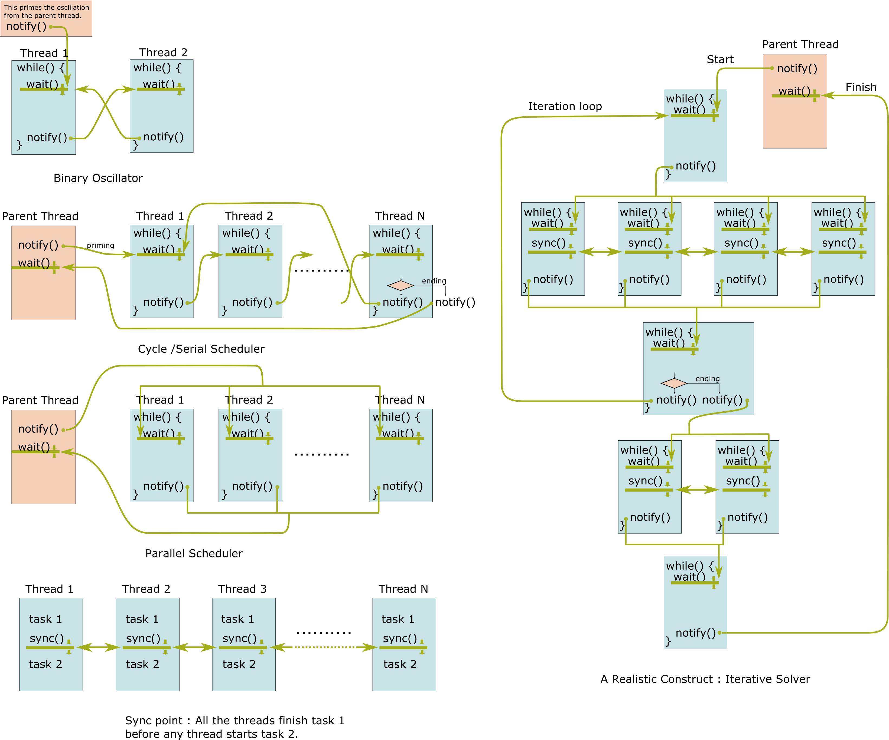
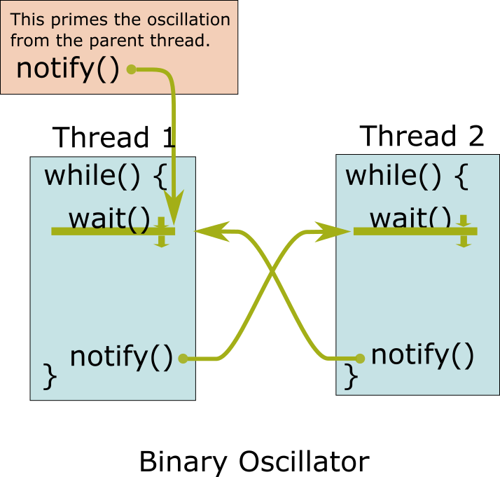
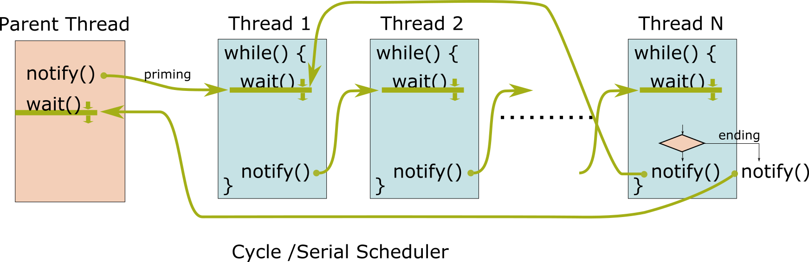
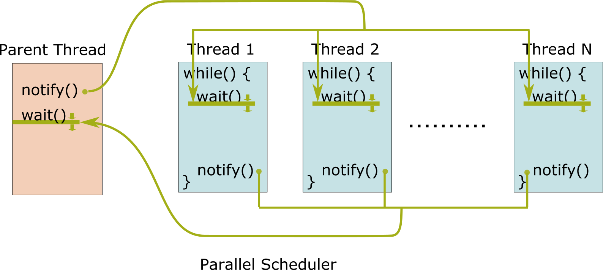
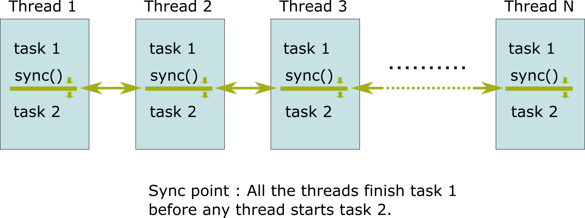
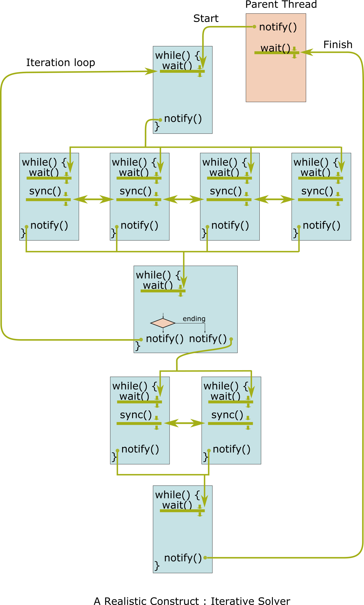

# Thread Synchronizer : C++ CPU Multi-threadding for Numerical Computing

<a href="pics/overview.png"></a>

## Highlights

* Simple efficient wait/notify mechanism including CUDA's __syncthreads()-like function.

* Portable. It depends on the standart library only. Provided in a small header file.

* Flexible and simple to use to form an execution flow in a digraph (SP-digraph + feedback edges)

* Simple replacement to OpenMP for the systems where OpenMP is not supported.

* Good control and visibility over what's going on in the code. Everything in standard C++.

## Overview

As we are apparently approaching the end of Moore's law, it seems to make more sense to utilize available processing power in multiple cores in normal applications.
Also, the modern application programs demand more and more numerical computing at runtime in the area such as machine learning, image processing, numerical optimization to name a few.

ThreadSynchronizer provides a straight-forward to understand, easy-to-use solution to the problem of implementing custom numerical computing in C++ with multi-threads.
It is portable, as it is written in C++ only and it depends only on the standard library.
It does not require additional mark-ups or pre-processing to the code.
Yet it achieves reasonably low overhead suitable for fine-grained paralell processing for the numerical computing.
It is also straightforward to integrate other technologies such as NEON SIMD intrinsics to the code.

In this page, we first formulate the intended use cases, and then introduce a minimum concrete example of makeing a binary oscillator to explain the core concept of ThreadSynchronizer.
Then we expand the concept and generalize it in order to implement general numerical computing with multiple worker threads.
Finally, we show some experimental results on Apple M1 Mac Mini and analyze the overhead of ThreadSynchronizer.


## Intended Use Cases.
The intended use cases are the numerically-intensive computing that run on application programs.
For example, it includes the iterative Jacobian solver for PD matrices where in each iteration the update to the X-vector can be done 
in parallel.
Another example is an image filter with 5x5 kernel, where the output pixel value can be caluculated independently to others.
(In reality we should use available technologies such as LAPACK for Jacobian solver and also CIImage for 5x5 convolution. This is just for illustration purpose only.)

Such cases are  characterized as follows.
It is different from the multi-threadding for web servers etc., which is viewed in terms of concurrent processing.

* **Determinism:** The executions paths are (almost) determined staticall before execution, in the sense that the execution is simply described in a digraph that consists of sp-graphs and feedback loops. It does not require the concurrency formalisms such as Hoare's CSP.

* **Non-blocking:** Each thread does not block waiting for file I/O  or network I/O. Each thread is dedicated to numeric computation.

* **Low-latency Requirement:** Each task must start with little latency upon receiving a notification.


# First Step: Binary-Oscillator
Before presenting samples and describing APIs, this section presents a problem of making binary osscilator out of two worker threads and solve it step-by-step
in order to establish a common understanding to make it easier to understand the purpose and the concept of ThreadSynchronizer.
This is the building block from which we can derive the necessary primitives for fine-grained parallel computing.

<a href="pics/binary_oscillator.png"></a>

Assume we have two free running worker threads running in while() loop.
We want to control those threads so that they run alternatingly.
```
thread1:
  while (true) {
    sem.acquire();
    do1();
    sem.release();
  }

thread2:
  while (true) {
    sem.acquire();
    do2();
    sem.release();
  }
```

Please see [sample_01.cpp](samples/sample_01.cpp).
All the sample codes in this document can be compiled with the following command line.
Please change the input and the output file names accordingly.

```clang++ -Wall -std=c++11 -O3 -I../common -o <sample_01> <sample_01.cpp>```

It uses `std::mutex` and `std::unique_lock` instead of `std::counting_semaphore`, which is supported as of c++20 and
apparently it is not yet supported on Macos at the time of writing.
( Apple clang version 12.0.5 (clang-1205.0.22.11) Target: arm64-apple-darwin20.6.0 ).


Enclosing two tasks with some synchronization primitives such as semaphore is not enough
as it does not guarantee the execution order.
We need a mechanism to communicate the timing to each other as follows.
```
thread1:
  wait_on_2();
  do1();
  notify_2();

thread2:
  wait_on_1();
  do2();
  notify_1();
```

### Use of Condition Variable

The best candidate for this purpose is the monitor & condition variable [B. Hansen 1972].
It has been implemented in POSIX as pthread_cond_t and as of c++11, std::condition_variable.

### Advantages of Condition Variable

The major advantage is the atomic operations of unlock & wait, and lock & wakeup on the waiter.
With this atomicity the waiter can release the lock only when its waiting for notification.
We can make the shared state consistent among participants by enclosing the lock.


An implementation with condition varialbe may look like this:
[sample_02.cpp](samples/sample_02.cpp)
This does not yet work due to the two problems described below.

### Problems with Condition Variable

* Spurious (false) wake-up during wait.
* The waiter must be waiting before the notifier notifies it. Otherwise the notification will be lost, which will easily lead to a deadlock.

Those two can be overcome by introducing two supplemental flags. Please see `task2_is_waiting` and
`task2_is_notified` below.


```
atomic_bool        task2_is_waiting(false);
atomic_bool        task2_is_notified(false);
mutex              mutex2;
condition_variable cond_var_2;

void task_1_notify_2()
{
  unique_lock<mutex> lock2( mutex_2, defer_lock );

  while( !task2_is_waiting ){;}  // --- (1)
  lock2.lock();
  task2_is_waiting  = false;
  task2_is_notified = true;
  lock2.unlock();
  
  cond_var_2.notify_one();
}

void task_2_wait_on_1()
{
  unique_lock<mutex> lock2( mutex_2, defer_lock );

  lock2.lock();
  task2_is_waiting = true; // ---(2)
  cond_var_2.wait( lock2, [&]{ return task_2_is_notified; } ); // --- (3)
  task_2_is_notified = false;
  lock2.unlock();  
}
```

This is the mechanism for task 1 to notify 2. The methanism for the other direction is obtained by swapping 1 and 2 above by symmetry.

* When task 1 notifies task 2, it first makes sure that the task 2 is already waiting.

* It first checks if `task2_is_waiting` is set. If it is set, task 1 knows that task 2 is at least at point (2).

* It then locks lock2 and then unlocks(). If the lock is successful, task1 knows that task is waiting at (3) after releasing the lock.

* Now task 1 can safely notify task 2 and it additionaly sets `task2_is_notified` to avoid spurious wake-up at (3).

We assume task1 immediately goes out of the spin wait at (1) most of the time, and hence such a spin wait is permissible.

### Final Version of Binary Oscillator.

An implementation with those fixes looks like this:[sample_03.cpp](samples/sample_03.cpp)

The wait & notification mechanism above has been encapsulated into 'class WaitNotifySingle' in [thread_synchronizer.h](thread_synchronizer.h)
And a sample implementation with this can be found in [binary_oscillator.cpp](samples/binary_oscillator.cpp).


## Cycle/Serial Scheduler
Next, we want to put 1...N free running worker threads in order such that their execusion forms a cycle as in
do1(), do2(), ..., doN(), do1(), do2()...

<a href="pics/cycle_scheduler.png"></a>

To implement this, we can simply chain the notification mechanism used for the binary oscillator in a longer loop.
Please see [cycle_scheduler_infinite.cpp](samples/cycle_scheduler_infinite.cpp), which keeps running,
and [cycle_scheduler_finite.cpp](samples/cycle_scheduler_finite.cpp), which ends after 10 cycles.

## Parallel Scheduler
Here, we want to control 1...N free running worker threads such that they run in parallel.

<a href="pics/parallel_scheduler.png"></a>

We can extend the notification mechanism to notify multiple threads and wait on multiple threads by introducing two internal counters.
The former is implemented in `class WaitNotifyMultipleWaiters` and the latter in `class WaitNotifyMultipleNotifiers` based on
the same idea as in WaitNotifySingle. See [thread_synchronizer.h](thread_synchronizer.h) for details.
A sample program is found in [parallel_scheduler.cpp](samples/parallel_scheduler.cpp).

## Synchronizing Threads in the Middle of the Execution
Here, we want to make the 1...N threads that are running parallel in a group aligned at a specific point during the execution.
This is equivalent to `__syncthreads()` in CUDA.
<a href="pics/sync_threads.png"></a>

This is especially useful if a task executes a loop and it must sync with other threads in the middle of each iteration.
Please see the code snippet below from [parallel_scheduler_with_mid_sync.cpp](samples/parallel_scheduler_with_mid_sync.cpp).

```
static inline bool task_with_inner_loop( 
    const int           tid,
    ThreadSynchronizer& s,
    const int           cnt,
    mutex&              lock_for_cout
) {
    for ( int i = 0; i < 4; i++ ) {

        lock_for_cout.lock();
        cout << "task: " << tid << " part 1 inner loop: " << i << " outer loop: " << cnt << "\n" << flush;
        lock_for_cout.unlock();

         s.syncThreads(tid); // --- (A)
         if (s.isTerminating())
            return true;

        lock_for_cout.lock();
        cout << "task: " << tid << " part 2 inner loop: " << i << " outer loop: " << cnt << "\n" << flush;
        lock_for_cout.unlock();

         s.syncThreads(tid); // --- (B)
         if (s.isTerminating())
            return true;
    }
    return false;
}
```
This is the main task launched in multiple threads in a group running in parallel.
It has two syncing points (A) and (B) in each iteration of the loop at the call to `s.syncThreads(tid)`.
The effect of such syncs can be seen in the output from [parallel_scheduler_with_mid_sync.cpp](samples/parallel_scheduler_with_mid_sync.cpp)
as follows.


```
task: 0 part 1 inner loop: 0 outer loop: 0
task: 1 part 1 inner loop: 0 outer loop: 0
task: 2 part 1 inner loop: 0 outer loop: 0
task: 2 part 2 inner loop: 0 outer loop: 0
task: 1 part 2 inner loop: 0 outer loop: 0
task: 0 part 2 inner loop: 0 outer loop: 0
task: 0 part 1 inner loop: 1 outer loop: 0
task: 2 part 1 inner loop: 1 outer loop: 0
task: 1 part 1 inner loop: 1 outer loop: 0
task: 1 part 2 inner loop: 1 outer loop: 0
task: 2 part 2 inner loop: 1 outer loop: 0
task: 0 part 2 inner loop: 1 outer loop: 0
task: 0 part 1 inner loop: 2 outer loop: 0
task: 2 part 1 inner loop: 2 outer loop: 0
task: 1 part 1 inner loop: 2 outer loop: 0
task: 1 part 2 inner loop: 2 outer loop: 0
task: 0 part 2 inner loop: 2 outer loop: 0
task: 2 part 2 inner loop: 2 outer loop: 0
task: 2 part 1 inner loop: 3 outer loop: 0
task: 0 part 1 inner loop: 3 outer loop: 0
task: 1 part 1 inner loop: 3 outer loop: 0
task: 1 part 2 inner loop: 3 outer loop: 0
task: 2 part 2 inner loop: 3 outer loop: 0
task: 0 part 2 inner loop: 3 outer loop: 0
...
```

You can see that part 1 from all the 3 threads finish before any of the threads starts part 2 in the same iteration,
and part 2 from the all the 3 threads for inner loop x finish before any of the threads starts part 1 in inner loop x+1.
This is a common idiom in CUDA GPGPU kernel programming, and it is useful for CPU multi threadding without splitting the body of the loop into pieces.

# Combining Together and Forming a Digraph.
By combining those synchronization primitives in [thread_synchronizer.h](thread_synchronizer.h) as building blocks,
we can make more complicated structures for CPU parallel numerical computation into digraphs as shown below.
Such a graph is decomposed into series-parallel digraphs and feedback edges.
The feedback edges represents loops, and series-parallel digraphs are decomposed further into the series parts, which are implemented as in Cycle/Series Scheduler above, and the parallel parts, which are implemented as in Parallel-Schdeuler above.

<a href="pics/iterative_solver.png"></a>

## API Reference

Please see the comments in [thread_synchronizer.h](thread_synchronizer.h).
It's a small header file that contains 5 small classes.

## Samples

* [binary_oscillator.cpp](samples/binary_oscillator.cpp) : It oscillates between two worker threads.

* [cycle_scheduler_infinite.cpp](samples/cycle_scheduler_infinite.cpp) : It cycles serially through N worker threads.

* [cycle_scheduler_finite.cpp](samples/cycle_scheduler_finite.cpp) : It cycles serially through N worker threads. It terminates after 10 cycles.

* [parallel_scheduler.cpp](samples/parallel_scheduler.cpp) : 3 worker threads run in parallel. It iterates 10 times.

* [parallel_scheduler_with_mid_sync.cpp](samples/parallel_scheduler_with_mid_sync.cpp) : 3 worker threads run in parallel. At each iteration, each task executes an inner loop of 4 iterations. In each inner iteration, the three threads align at two points (A) and (B).

For Macos, [Makefile](Makefile) is available. Just type `make all` to build all the sample programs.

## Compilation

Include the header file to the source code as follows:

```#include "thread_synchronizer.h"```

And it should compile with any standard c++11 compiler.
The samples above have been tested with the following command line:
```clang++ -Wall -std=c++11/c++14/c++20 -O3 -I.  -o output sample_XX.cpp```


## Experiments
I have done some experiments on Apple Mac Mini to measure the performance of each type of the notification mechanisms in 
[thread_synchronizer.h](thread_synchronizer.h).
The experiments consist of three parts:

* The first part with **cyclic scheduler** to measure the overhead of Cycle/Series Scheduler, i.e., the overhead of `WaitNotifySingle`. 
* The second part with **parallel scheduler** for `WaitNotifyMultipleWaiters` and `WaitNotifyMultipleNotifiers`.
* The third partwith **parallel scheduler with syncThread** for `WaitNotifyEachOther::syncThreads()`.

The numbers in the following table are observed in the following environment.

* Mac Mini (M1, 2020) 8GB Memory

* macOS Big Sur 11.5.2

* Apple clang version 12.0.5 (clang-1205.0.22.11).

The implementation for the experiments are found in [test_cpu_parallel_processing.cpp](test/test_cpu_parallel_processing.cpp)


The experiments can be reproduced by `make test` in this directory in a terminal.

### Results
|Type                                 | Num Threads | Counter      | Num Iterations | Mean Time [ms] | Stddev.[ms] |
|:------------------------------------|------------:|-------------:|---------------:|---------------:|------------:|
| cyclic scheduler                    |   2         | 100          | 100            | 22.48          |     0.005937|
| cyclic scheduler                    |   3         | 100          | 100            | 45.82          |    0.0001324|
| cyclic scheduler                    |   5         | 100          | 100            | 70.91          |    0.0002323|
| cyclic scheduler                    |  10         | 100          | 100            | 108.1          |    0.0000405|  
| cyclic scheduler                    | 100         | 100          | 100            | 1402           |    0.02342  |
|                                     |             |              |                |                |             |
| parallel scheduler (naive)          |  4          | N/A          | 10000          | 460.0          | 0.0005817   |
| parallel scheduler (naive)          | 16          | N/A          | 10000          | 1493           | 0.4318      |
| parallel scheduler (naive)          | 64          | N/A          | 10000          | 6073           | 1.069       |
| parallel scheduler                  |  4          | N/A          | 10000          | 52.31          | 0.0000517   |
| parallel scheduler                  | 16          | N/A          | 10000          | 271.1          | 13.2        |
| parallel scheduler                  | 64          | N/A          | 10000          | 1124           | 89.82       |
|                                     |             |              |                |                |             |
| parallel scheduler with syncThread  |  4          | N/A          | 10000          | 91.46          | 0.0000517   |
| parallel scheduler with syncThread  | 16          | N/A          | 10000          | 356.3          | 10.41       |
| parallel scheduler with syncThread  | 64          | N/A          | 10000          | 1421           | 178.4       |

### Cyclic/Series Scheduler
The cycle scheduler is made with the given number of threads. During the execution the first thread counts up the counter by 1.
The last thread in the cycle compares the value with 100, and if it hits 100, it notifys the parent thread. Otherwise it keeps notifying the first
thread to start a new cycle. This process is repeated "Num Iterations".
For example, for the first column, the 100 * 100 cycles are performed with the cycle length of 2.
This means the number of WaitNotifySingle::notify()/wait() are 20,000.
All the threads do nothing other than counting up in the first thread and the comparison n the last thread.
It can be considered the overhead of one notify()->wakeup from wait() will be around 
22.48/20,000 = 1.1 micro seconds. In the same way the overhead for the other 4 configurations are respectively: 1.5, 1.4, 1.0, and 1.4 micro seconds.

**This indicates the overhead of `WaitNotifySingle::notify()`->wakeup from `WaitNotifySingle::wait()` between two threads is around 1.0 - 1.5[μs]**.

As a rough indicater, if the core runs in 3 GHz, and executs 8 instructions per clock-cycle at its peak performance,
then about 30,000 instructions could be executed during 1.0 [μs].
However the number of instructions performed will be magnitude smaller in reality due to pipeline stalls such as branch-prediction failures and cache misses.
Even if this is the case, this number suggests it may not worth using multi threadding for small problems, such as solving problem with matrix of 64x64, etc.

Please see `class CyclicScheduler` in  [test_cpu_parallel_processing.cpp](test/test_cpu_parallel_processing.cpp) for the implementation of this expreiment.

### Parallel Scheduler
The experiments were conducted for two types; One as a baseline, where threads are conctructed, launched, joined, and destructed in each iteration.
The other is with `WaitNotifyMultipleWaiters` & `WaitNotifyMultipleNotifiers`, 
where the worker threads wake up from `WaitNotifyMultipleWaiters::wait()`, 
notify the parent with `WaitNotifyMultipleNotifiers::notify()`
and then waits for the parent in `WaitNotifyMultipleWaiters::wait()` for the next iteration.

This is repeated for 10,000 times. The worker threads do nothing other than wait and notify.
The numbers in the table are interpreted as follows:

For the cases with 4 worker threads, the round trip time for the parent thread in each iteration from 
WaitNotifyMultipleWaiters::notify() to the wakeup from `WaitNotifyMultipleNotifiers::wait()` will be 52.31 [ms]/10,000 = 5.2 microseconds.
If we replace the synchronization mechanism with thread creation, join, and destruction (naive case),
then the round trip time for the parent will be 460 [ms]/10,000 = 46 microseconds, which is about 9 times slower.
Since all the threads do nothing other than wait and notify, the roundtrip time can be considered as the overhead of the following two:

* WaitNotifyMultipleWaiters::notify() by the parent => WaitNotifyMultipleWaiters::wait() by N worker threads
* WaitNotifyMultipleNotifiers::notify() by N worker threads =>WaitNotifyMultipleNotifiers::wait() by the parent

**In essence the overhead of such synchronizations for worker threads would be:**

* **5.2 [μs] for 4 worker threads**

* **27  [μs] for 16 worker threads**

* **110 [μs] for 64 worker threads**

Please see `class ParallelSchedulerNaive ` and `class ParallelSchedulerWithPooling` in  [test_cpu_parallel_processing.cpp](test/test_cpu_parallel_processing.cpp) for the implementation of this expreiment.

### Synchronizing Threads in the Middle of the Execution

This experiment is based on `class ParallelSchedulerWithPooling` with additional WaitNotifyEachOther::syncThreads() in each worker thread.
The corresponding roundtrip time will be: 91.46 / 10,000 = 9.1 [μs] for 4 worker threads, 
 356.3 / 10,000 = 36 [μs] for 16 worker threads, and 1421 / 10,000 = 14 [μs] for 64 worker threads.
If we subtract the roundtrip time for Paralel Scheduler above, we can get the overhead of WaitNotifyEachOther::syncThreads().

**In essence the overhead of syncThread() would be:**

* **3.7 [μs] for 4 worker threads**

* **85 [μs] for 16 worker threads**

* **297 [μs] for 64 worker threads**

Please see `ParallelSchedulerWithPoolingWithMidSync` in  [test_cpu_parallel_processing.cpp](test/test_cpu_parallel_processing.cpp) for the implementation of this expreiment.


## License

MIT license


## References:

* [B. Hansen 1972] https://link.springer.com/article/10.1007%2FBF00288684
